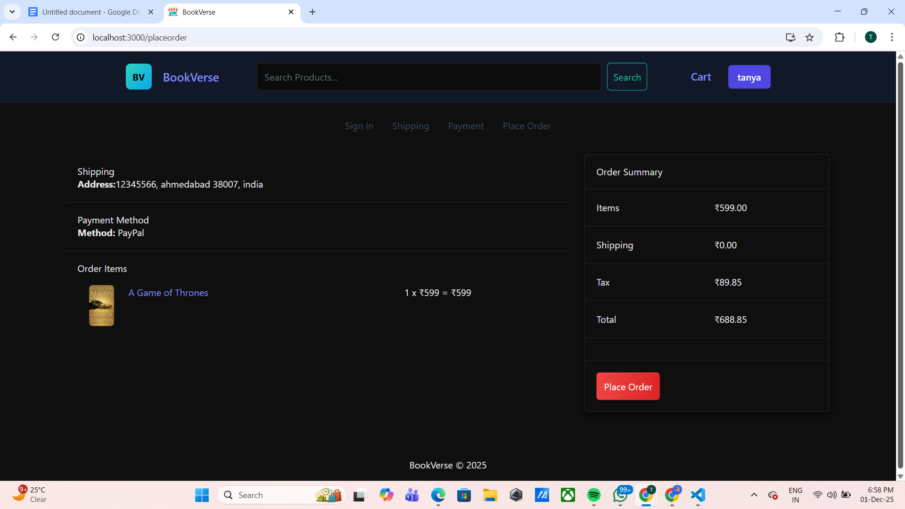
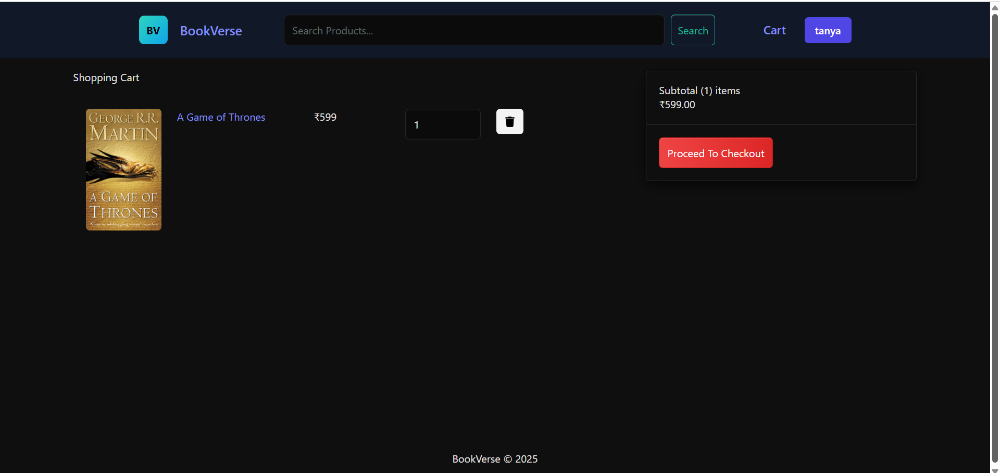
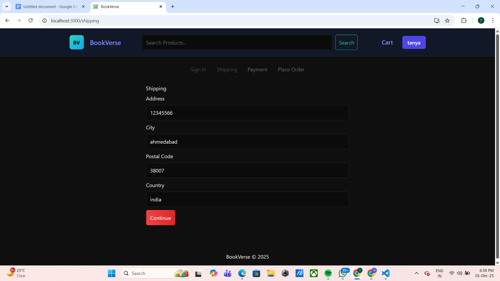
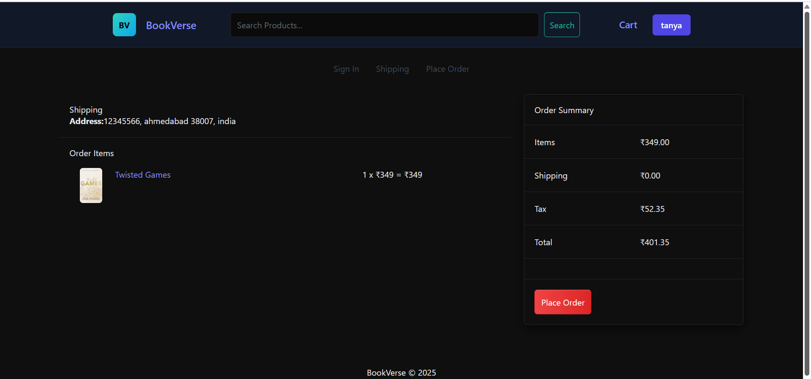

📚 BookVerse – Online Bookstore (MERN Stack)

BookVerse is a full-stack online bookstore built using the MERN stack.
Users can browse books, search by title, add items to cart, leave reviews, and place orders.
Admins can manage products, users, and orders.

This project follows all the guidelines required for academic evaluation (Frontend, Backend, EJS, MongoDB, Tailwind, API testing, JWT authentication, CRUD, etc.).

🐙 GitHub Repository

https://github.com/tanya-2802/BookVerse

📌 Features
🌟 User Features

Browse all books with pagination
View detailed book descriptions
Add books to cart
Adjust quantity & remove items
Register & login using JWT-based authentication
Post ratings and reviews
Checkout flow (shipping, payment selection, and place order)
Fully responsive UI (Tailwind + Bootstrap Mixed UI)
Dark themed modern interface
Search books by keyword

🛒 Admin Features

Admin login
Create new books
Edit/update book details
Delete books
View all users
Manage orders
Mark orders as delivered

🧩 Tech Stack
Frontend
React.js (Function Components)
React Router DOM
Redux Toolkit
TailwindCSS (styling)
Axios
Bootstrap + React-Bootstrap
React Icons
Backend
Node.js
Express.js
MongoDB + Mongoose
JWT Authentication
Multer (image uploads)
Morgan (logger)
CORS
dotenv

📁 Folder Structure
BookVerse/
 ├── backend/
 │   ├── config/
 │   ├── controllers/
 │   ├── middleware/
 │   ├── models/
 │   ├── routes/
 │   ├── views/ (EJS pages)
 │   ├── uploads/
 │   └── server.js
 │
 ├── frontend/
 │   ├── public/
 │   ├── src/
 │   │   ├── components/
 │   │   ├── screens/
 │   │   ├── slices/
 │   │   ├── assets/
 │   │   └── App.js
 │   └── package.json
 │
 ├── README.md
 ├── package.json
 └── .gitignore

🔐 Authentication Overview

BookVerse uses JWT-based authentication for users and admins.
When the user logs in, the backend generates a signed JWT token and stores it inside an HTTP-only cookie.
This token is automatically sent with each request to protected routes.
The backend verifies the token using custom protect middleware and attaches the authenticated user to the request.
Admins have a separate middleware admin that ensures only authorized users can access admin routes.
No passwords are stored in plain text — everything is hashed using bcrypt before saving in MongoDB.

🧪 API Testing

All REST API endpoints were tested using Hoppscotch/Postman:

✔ GET (fetch all products)
✔ POST (create review, create product)
✔ PUT (update product)
✔ PATCH (update price)
✔ DELETE (delete product)
✔ Authentication endpoints
✔ Order & User routes

📷 Screenshots

### 🏡 Homepage

### 📚 Book Detail Page

### 🛍️ Cart Page

### 🚚 Shipping Page

### 💳 Place Order Page

### 🎉 Order Success Page

📌 Third-Party Tools Used

React Toastify
React Icons
Morgan
Multer
TailwindCSS CDN

📚 Conclusion

BookVerse is a complete full-stack MERN application with authentication, CRUD operations, payment workflow, admin panel, and responsive UI — meeting all academic project requirements.